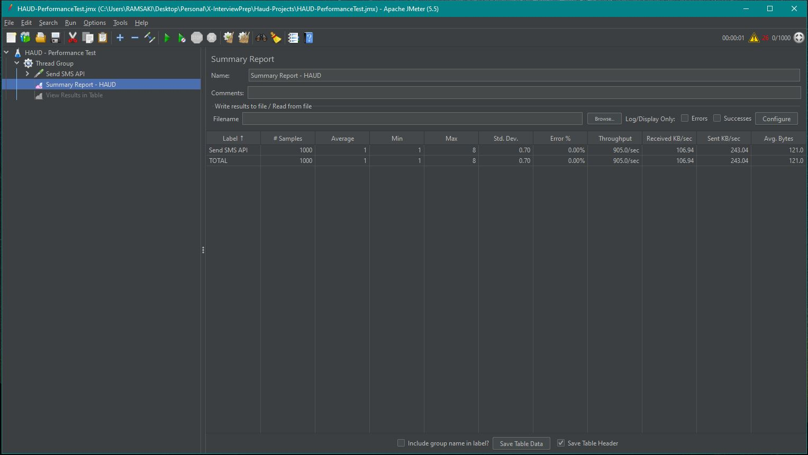

# HAUD - Technical Test Project

## General Overview

- I used rabbitMQ as a messaging broker to handle communication between the services
- I implemented a blocking service to block specific destination addreses from receiving messages
- I used H2 as an in-memory database for storing blocked destinations and charging info
- I implemented a charging service to handle the charging of messages and storing the information in db
- I implemented a REST API for getting monthly reports per SMS source address which includs sent SMS count to per destination address

### Focused on:
- Scalability to be sure the throughput of messages (over 1000 messages per second)
- Being sure the gateway service can handle a large number of requests and handle them in a timely manner
- Ensuring the charging service can handle and process the incoming messags
- Making sure the blocking service works effectively to block certain destination addresses
- Ensuring the REST API for getting monthly reports is easy to use and understandable

### NOT Focused on:
- Exception Handling & GenericException Handler
- Request validations
- Security such as authentication and authorization
- Specific filtering operations like message prioritization & getting ack info and retry

## Running the program
### local
Just run the command if you are on linux-based os or you have installed bash on win
> ./run-services.sh

I created a stop-services.sh but it was not working stable so when you start the services
with above script you need to find the process ids and kill manually like below:
> ps -ef  
> kill -9 pid

### docker-compose
1) Just run below command to start the services
> docker-compose up --build
2) Gateway service ll be running on http://localhost:8080
3) Charging service ll be running on http://localhost:8090
4) Use the blocking service to manage blocked destination addresses
5) Use the REST API to send messages and get monthly reports
6) Stop the services by running
> docker-compose down

#### Sending Messages

To send a message; use  <em><u><b>/api/v1/send</u></em></b> endpoint of the gateway service with a JSON body in the format:

>{
"source": "+1231231232",
"destination": "+43534543534",
"message": "Sample Test Message"
}

#### Getting Monthly Reports

To get monthly reports; use <em><u><b>/api/v1/charging/monthly-report/{year}/{month}</b></em></u> endpoint of the gateway service.
Replace {source} with the desired source address and {month} with the desired month in the format yyyy-MM.

#### Managing Blocked Destinations

To manage blocked destinations; use <em><u><b>/api/v1/blocked-destinations</b></em></u> endpoint of the gateway service.
Use the appropriate HTTP method (GET, POST, PUT, DELETE) to add, update, or delete a blocked destination.

#### Sample JMeter Result
